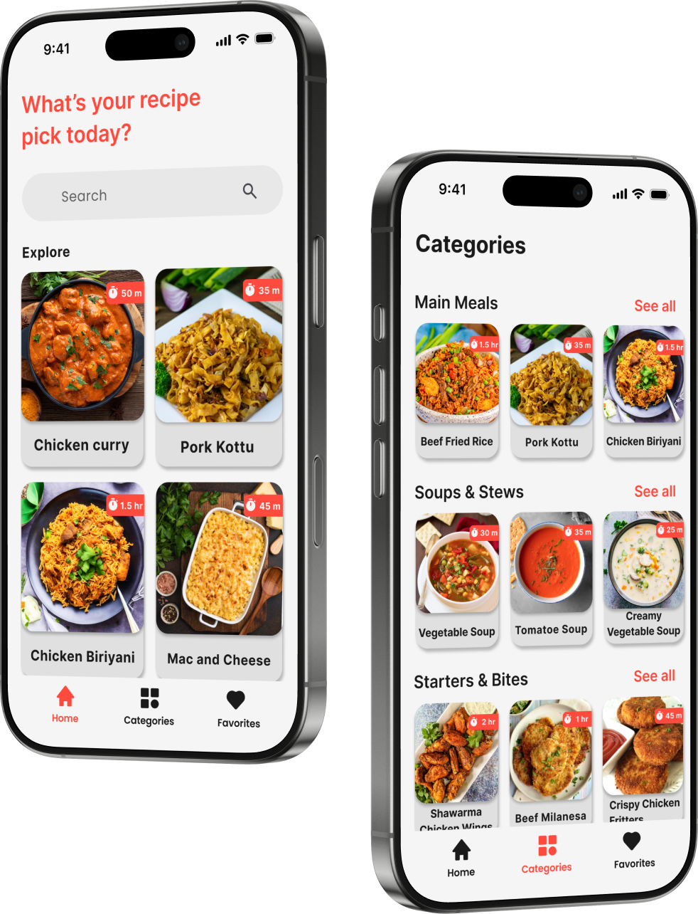
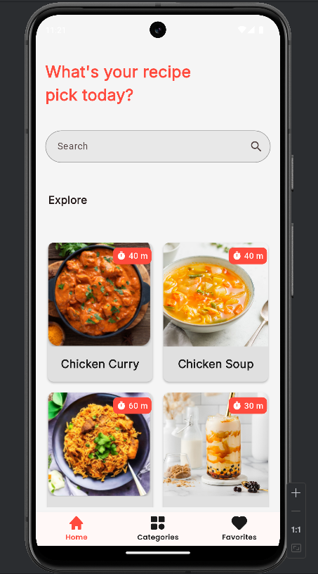
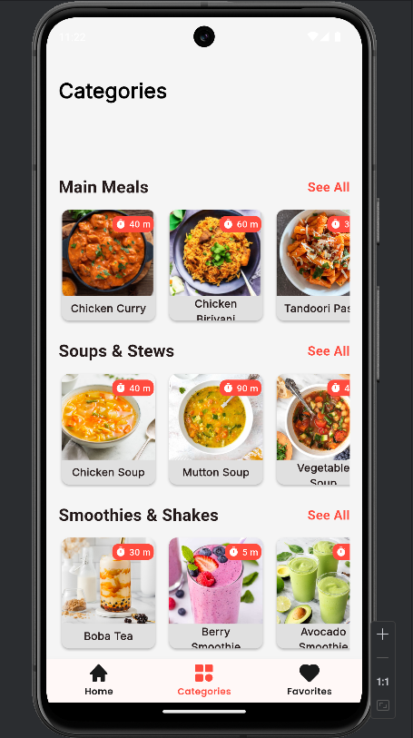
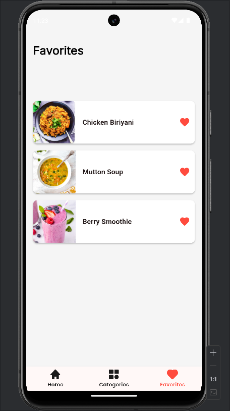
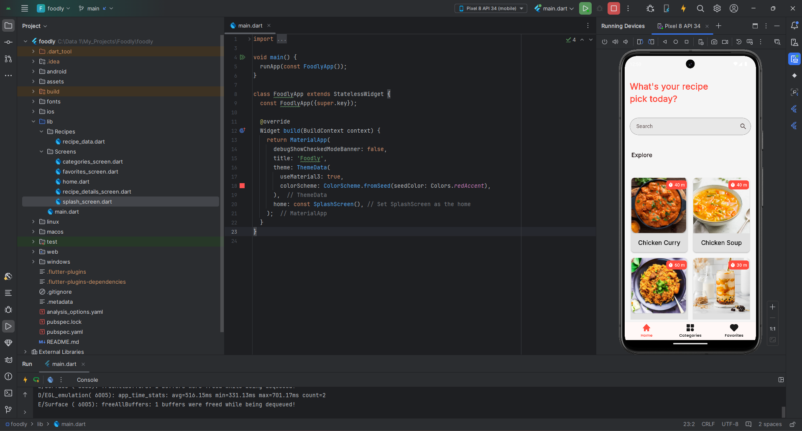

<p align="center"> 
<h1 align="center">Foodly App </h1>

A delightful Android application developed using **Flutter** and **Dart** technologies. This app helps users find, save, and follow their favorite recipes. Foodly offers a user-friendly interface for a seamless and enjoyable cooking experience.


## Features

- **Find Recipes:** Discover a variety of delicious recipes from different cuisines.
- **Favorite Recipes:** Mark your favorite recipes for easy access through the Favorites tab.
- **Recipe Details:** Each recipe includes ingredients, cooking time, and step-by-step instructions.
- **User-Friendly Interface:** Designed to provide a smooth and intuitive user experience.

---

## Getting Started

### Prerequisites

- [Flutter](https://flutter.dev/) and [Dart](https://dart.dev/) installed on your machine.
- A compatible IDE such as [Android Studio](https://developer.android.com/studio) or [Visual Studio Code](https://code.visualstudio.com/).

### Installation

1. Clone the repository:
    ```sh
    git clone https://github.com/YourUsername/Foodly.git
    ```
2. Navigate to the project directory:
    ```sh
    cd Foodly
    ```
3. Install dependencies:
    ```sh
    flutter pub get
    ```

### Development

1. Start the Flutter development server:
    ```sh
    flutter run
    ```

### Build

1. Build the APK for deployment:
    ```sh
    flutter build apk
    ```

### Screenshots
Here are some interface screenshots of the app:
<p align="center">    </p>

### Demonstration
Here's a short demonstration of the app:
<p align="center"> <a href="https://youtu.be/ix8vhLV0cF4">  </a> </p>

---

## Final APK Download

You can download the latest version of the **Foodly** APK from the link below:

➡ **[Download APK] [Download Foodly apk](https://drive.google.com/file/d/1R9zIJTWLCMEbeCzAI3LxJbbsMk7NWZVj/view?usp=sharing)**

---

### ⚠ Important Note
- **Last Updated:** *2025-02-09*
